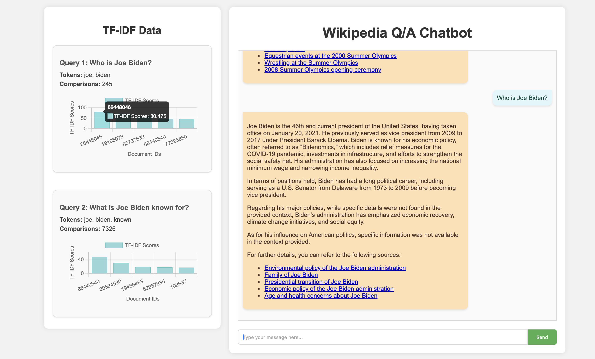

# WikiChatter
Wikipedia chatbot with local knowledge leveraging classical IR techniques for efficient retrieval and LLM for meaningful response.
## Chatbot demo:


## Inverted Index location

Please download from [inverted-index.json](https://buffalo.box.com/s/ovoeppydgdol89u6c2cethq90v05s6ui) and place in the root directory.

## Code Execution

Go to root directory and run:
   ```bash
   python3 app.py
```

Open browser and navigate to localhost
